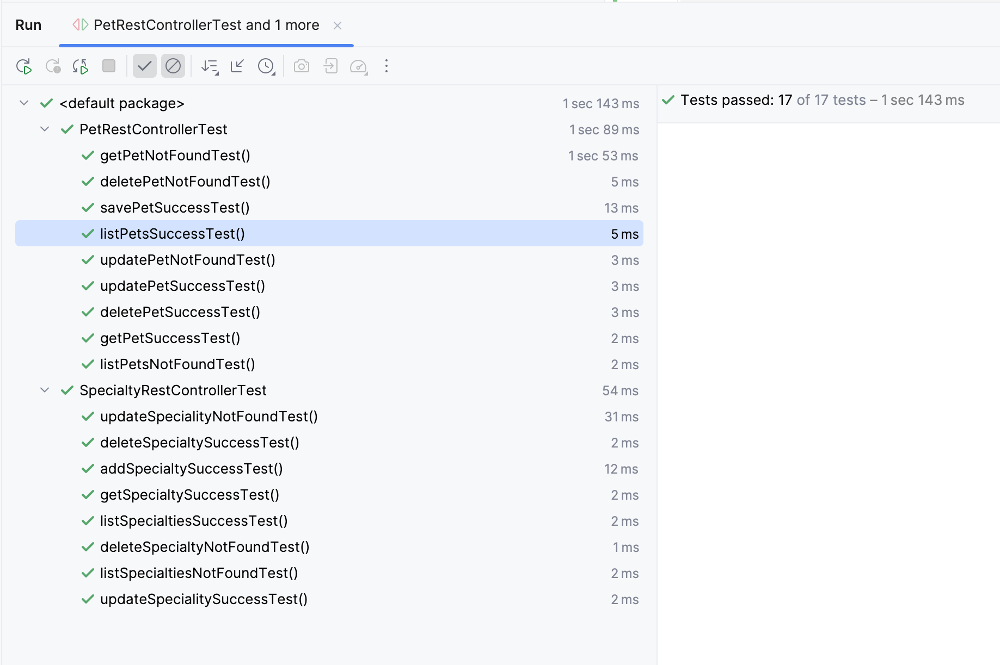

# Pruebas de Controladores REST para Pet Clinic

## Descripción

Este proyecto contiene pruebas unitarias para los controladores REST de la aplicación Spring Pet Clinic, específicamente para:

- `org.springframework.samples.petclinic.rest.controller.PetRestController`
- `org.springframework.samples.petclinic.rest.controller.SpecialtyRestController`

## Pruebas Implementadas

### PetRestControllerTest

- `getPetNotFoundTest()`
- `deletePetNotFoundTest()`
- `savePetSuccessTest()`
- `listPetsSuccessTest()`
- `updatePetNotFoundTest()`
- `updatePetSuccessTest()`
- `deletePetSuccessTest()`
- `getPetSuccessTest()`
- `listPetsNotFoundTest()`

### SpecialtyRestControllerTest

- `updateSpecialityNotFoundTest()`
- `deleteSpecialtySuccessTest()`
- `addSpecialtySuccessTest()`
- `getSpecialtySuccessTest()`
- `listSpecialtiesSuccessTest()`
- `deleteSpecialtyNotFoundTest()`
- `listSpecialtiesNotFoundTest()`
- `updateSpecialitySuccessTest()`



## Tecnologías Utilizadas
- **Java 17**: Lenguaje de programación.
- **Maven 3.9.6**: Gestión de construcción y dependencias.

### Additional Information
- Informe generado: 31-07-2024 00:42

### Ejecución de Pruebas

Para ejecutar las pruebas e2e, utiliza el siguiente comando:

```sh
mvn clean test
```
